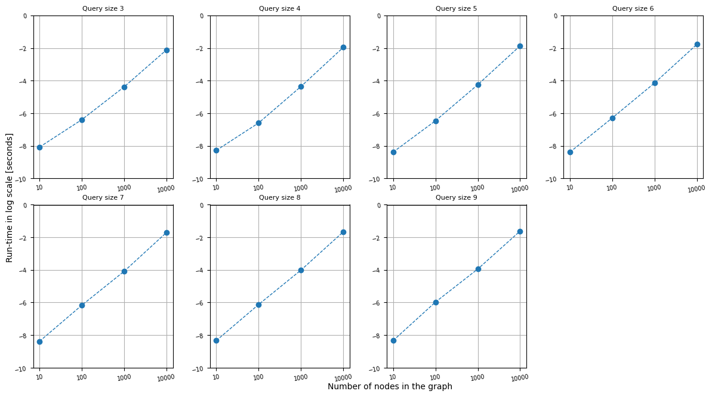
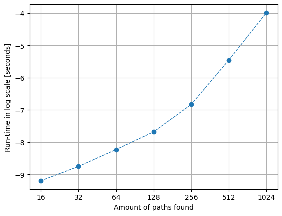
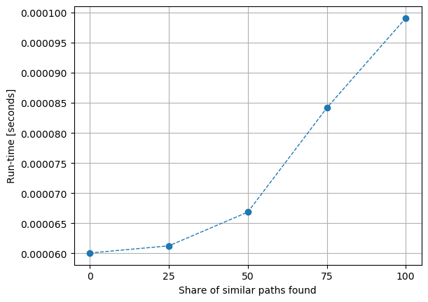

# INF205 Paths in labelled graphs
#### Programming project in INF205 Resource-efficient programming at NMBU

The point of the project is to take in a labelled graph *g* and two sequences *p* and *q* of edge labels and check if there exist a path *p* and a path *q* that contains the same start node and end node. 

### Run the full program
To run the full program you go into the [src](src/)-folder and type *make* in the terminal. 

First the makefile will go into the [directed-graph](src/directed-graph)-folder and runs the [makefile](src/directed-graph/Makefile) for this directory. This makefile will run [run-graph.cpp](src/directed-graph/run-graph.cpp) which contains code from run-graph.h graph.h, query.h and graph-benchmark.h

After the [makefile](src/directed-graph/Makefile) from [directed-graph](src/directed-graph) is ran, the [makefile](src/Makefile) in [src](src/) will run the [main.cpp](src/main.cpp) which contains functions form comparing-paths.h. 

### Benchmark run-time
The run-time has been tested on [run-graph.cpp](src/directed-graph/run-graph.cpp) and [directed-graph](src/directed-graph). 

The run-time for run-graph.cpp is tested in [time-run-graph.cpp](src/directed-graph/time-run-graph.cpp) in [src/directed-graph](src/directed-graph). The time is written to [TimeRunGraph.dat](src/results/TimeRunGraph.dat) in [src/results](src/results). 

The run-time for [comparing-paths.cpp](src/comparing-paths.cpp) is tested in [time-comparing-paths.cpp](src/time-comparing-paths.cpp) in [src](src/). The time is written to [TimeComparingPaths1.dat](src/results/TimeComparingPaths1.dat) and [TimeComparingPaths2.dat](src/results/TimeComparingPaths2.dat) in [src/results](src/results/). 

### Plot run-time 
The results of benchmarking the run-time is read by [plot_timing_inf205.py](src/results/plot_timing_inf205.py). The mean of the time is calculated and then plotted. 

## The code 
##### config
##### README.md
### src

folder containing 
##### main.cpp

main code to run everything 

##### comparing-paths.cpp

compares the path 

##### time-comparing-paths.cpp

measures the run time for comparing-paths.cpp

#### results 

folder containing results of everything 
- the different files 

#### directed-graph

folder containing 

##### run-graph.cpp

...

##### time-run-graph.cpp

...

##### graph.cpp

...

##### query.cpp

...

##### graph-benchmark.cpp

...
