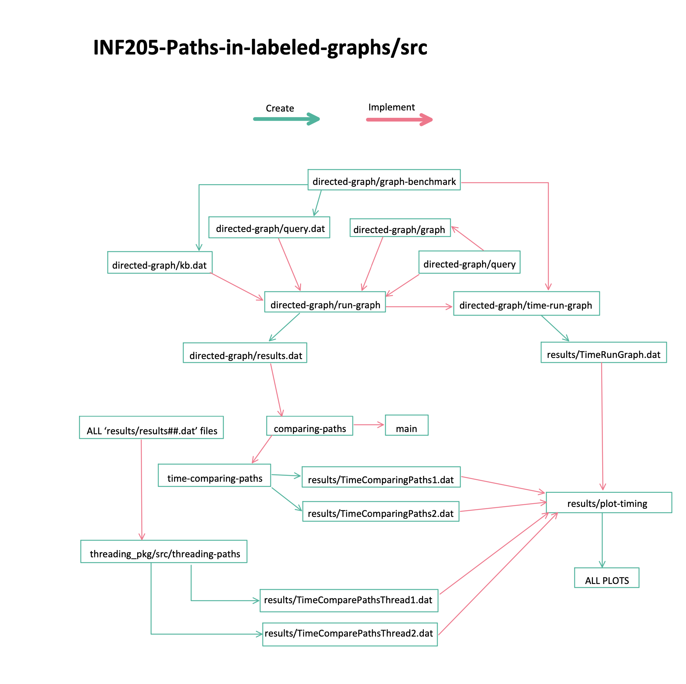

# INF205 Paths in labelled graphs
## Programming project in INF205 Resource-efficient programming at NMBU
The point of the project is to take in a labelled graph *g* and two sequences *p* and *q* of edge labels and check if there exist a path *p* and a path *q* that contains the same start node and end node. 

## The code 

### src
The folder containing the whole directory

##### main.cpp
You run this code and it will run the most important file for comparing the paths. However, running Makefile in src-folder is better. 

##### comparing-paths.cpp
Compares the paths that is read from results.dat and writes out the similar paths 

##### time-comparing-paths.cpp
time-comparing-paths.cpp reads different pre-made result-files from src/results and uses these with comparing-paths.cpp and takes the time it takes to run. It is tested several times. 

#### results 
Folder containing all the different results 
- Results with different amounts of paths found from 2^4 to 2^13
- Results with different amount of equal paths found: 0%, 25%, 50%, 75% and 100%
- plot-timing.py - code for plotting the results 
- 6 different plots saved as png 
- 5 different .dat-files with the time it took to benchmark-testing 
- kbt.dat and queryt.dat which contains data used to benchmark run-graph.cpp

#### directed-graph
Folder containing the code for creating the graph and finding valid paths to use in comparing-paths

##### graph-benchmark.cpp
Creates a graph which is written into file $kb.dat$ and the partitions p and q, which are written into $query.dat$ file.

##### run-graph.cpp, graph.cpp and query.cpp
run-graph.spp reads the files kb.dat and query.dat and uses graph.cpp and query.cpp to find the paths in the graph. The paths is written to results.dat. 

##### time-run-graph.cpp
time-run-graph.cpp creates kbt.dat and queryt.dat with different input. Then it uses these files to take the time it takes to run comparing-paths.cpp. It is tested several times and written to a file. 

#### threading_pkg 
- Package containing the necessary files for message-passing concurrency with ROS

##### src
- The folder containing the whole directory with threading

###### threading-paths.cpp
- Compares the paths that is read from results.dat files, but implements message-passing concurrency with ROS. 

## How does it work and how to use it
The code starts by generating the graph by using graph-benchmark.cpp. You can choose the number of nodes and query size in /src/directed-graph/Makefile on line 3, where the different variables are in the following order; ./run-graph <number of nodes> <query size> <kb.dat> <query.dat> 1
  
To be able to run the correct Makefile you need to change folder to src, and run 'make' in terminal. Shortly the results will appear in terminal where you have all the similar paths compared from results.dat.

## Performance 
### Run time for run-graph.cpp with different amount of nodes in the graph 
First the time run time was tested for run-graph.cpp with different amount of nodes in the graph in every plot, and each plot had different query size was. 
The run time appears to be linear with run time O(n), and the slope increases slightly when the query size increases. 

### Run time for run-graph.cpp with different query sizes
Second the time run time was tested for run-graph.cpp with different query size in every plot, and each plot had different amount of nodes in the graph. 
There can not be a query size that is longer than the amount of nodes in the graph. Therefore each plot has more and more points in accordance with the graph size. 
The run time seems to be exponential O(n^2), and it takes longer with a bigger graph. 

### Run time for comparing the paths with different amounts of paths found 
The run time for comparing the paths with different amounts of paths found was tested with and without threading. 
The run time is linear O(n). 
When there is a small amount of paths found the code with threading is slower, but when there is a large amount of paths found the code is slightly faster, but barely noticeable. If we tested on larger numbers we would probably be able to see a bigger difference. This could be something for further work. 

 

### Run time for comparing the paths with different amounts of equal paths found 
The run time for comparing the paths with different amounts of equal paths found was tested with and without threading. 
Without threading the run-time seems to be exponential (O(n^2)), but linear (O(n)) with threading. 
The code is noticeably faster with threading. 

 

## Concurrency 

### step by step
#### Without ROS
- uncomment for printing out results to terminal 
- uncomment if you only want to run the function compare_paths in threading-paths.cpp. In other words not testing the efficiency in threading-paths.cpp
- Run "make" in terminal from folder "threadin_pkg/src"
- Run "./threading-paths" in terminal from folder threading_pkg/src
- Run "plot-timing.py" to plot the results from threading-paths.cpp that doesn't use ROS

#### Using ROS
- uncomment for printing out results to terminal 
- uncomment for ROS concurrency in threading-paths.cpp. Here you have to uncomment parts of the compare function. You also have to uncomment the included user-defined files or system header files.  
- uncomment if you only want to run the function compare_paths in threading-paths.cpp. In other words not testing the efficiency in threading-paths.cpp
- Run "catkin_make" in "catkin_ws" folder
- Copy the files threading-paths and threading-paths.o from  folder catkin_ws/devel/bin/ and paste those into threading_pkg/src folder 
- Run "./threading-paths" in terminal from folder threading_pkg/src
- Run "plot-timing.py" to plot the results from threading-paths.cpp, which uses ROS

## Further work 
- Track down the first queries, and assign p and q to either one of the paths. 
- An easier way to implement the treading 
- Most likely memory leak 
